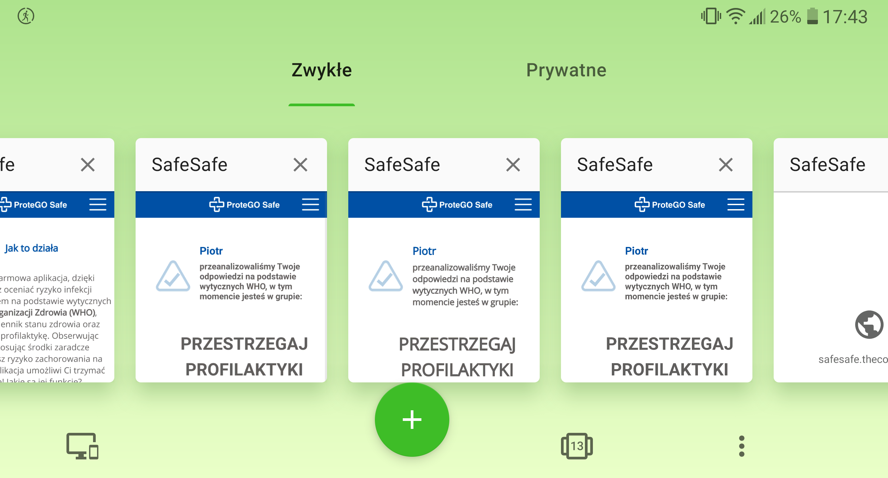
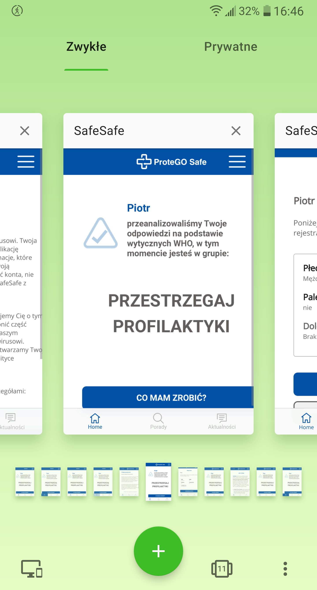

Telefon LG G6 (H870)  
Android 9.0 (3.18.120)  

Kroki, by powtórzyć:  

1. Użytkownik wchodzi w aplikacje SafeSafe  
2. Zagłębia się w aplikację (wypelnia ankiety, wchodzi na numery alarmowe, wybiera dololne sekcje z menu "chamburgera"  

Screeny:  

  

