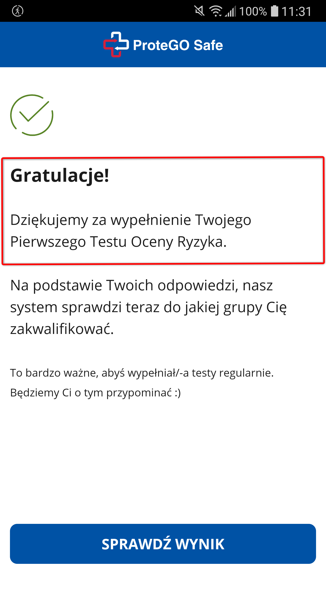

Telefon LG G6 (H870)  
Android 9.0 (3.18.120)  

Problem występuje również w wersji "stacjonarnej" (PC)  

System Operacyjny: Windows 10 Home Edition  
Przeglądarka: Opera 67.0.3575.115  

Kroki, by powtórzyć:  

1. Użytkownik otwiera aplikację mobilną SafeSAfe  
2. Z menu Chamburgera wybiera "Ankieta Oceny Ryzyka"  
3. Użytkownik używa przycisku "wykonaj test oceny ryzyka", nastepnie "dalej" oraz wypełnia całą ankietę  
4. Po wypełnieniu ankiety każdy kolejny raz (pomijając wypełnienie ankiety po raz pierwszy) wyświetla się informacja sugerująca, że test ZAWSZE wykonywaliśmy pierwszy raz.  

Oczekiwany rezultat:    
Podczas wypełniania ankiety oceny ryzyka któryś raz z kolei, informacja o tym powinna być inna względem wypełniania tej ankiety po raz pierwszy.

Screeny:  

