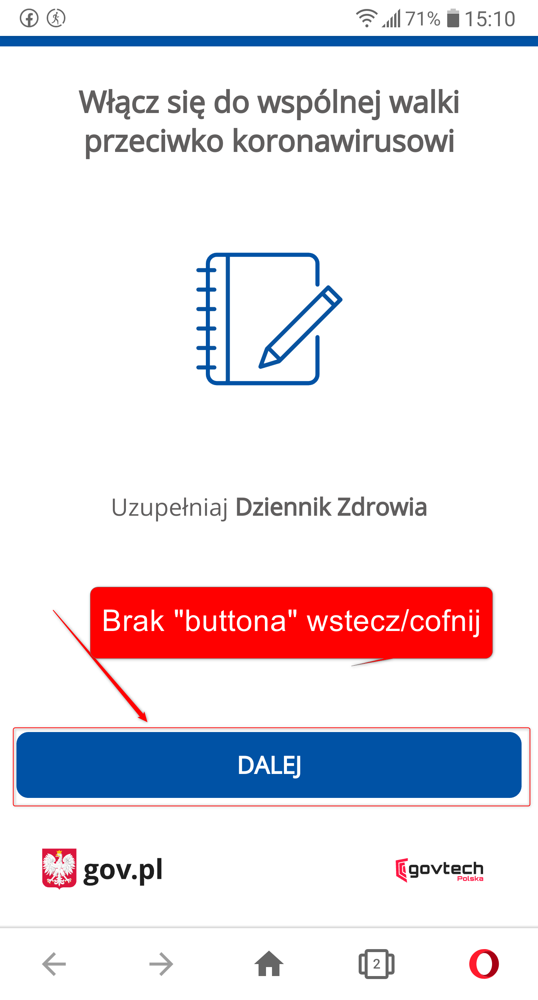

Telefon LG G6 (H870)
Android 9.0 (3.18.120)

Problem występuje również w wersji "stacjonarnej" (PC)

System Operacyjny: Windows 10 Home Edition
Przeglądarka: Opera 67.0.3575.115  

Kroki, by powtórzyć:  

1. Użytkownik włącza aplikację SafeSafe, lub wersję desktopową  
2. Użytkownik wciska button "ROZPOCZNIJ"  
3. Użytkownik wciska button "DALEJ"  
4. Użytkownik może kontynuować tylko i wyłącznie "do przodu", brak możliwości powrotu do wcześniejszej informacji.  

Screeny: 

