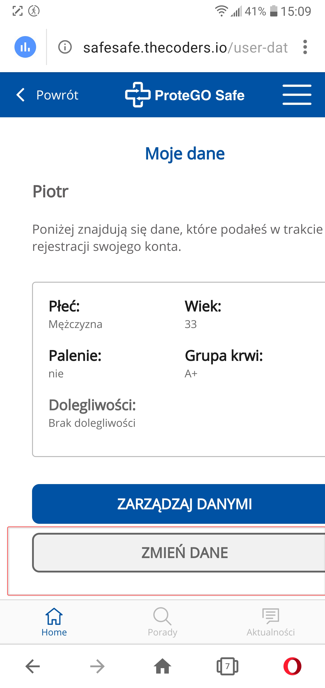

Telefon LG G6 (H870)  
Android 9.0 (3.18.120)  

Problem występuje również w wersji "stacjonarnej" (PC)  

System Operacyjny: Windows 10 Home Edition  
Przeglądarka: Opera 67.0.3575.115  

Kroki, by powtórzyć:  

1. Użytkownik otwiera aplikacje SafeSafe  
2. Z menu chamburgera wybiera opcje "polityka prywatności"  
3. Nastepnie wybiera "Dane"  

Aktualny rezultat.  
Przycisk odpowiadający za edycję danych w profilu użytkownika jest nieaktywny, brak możliwości edytowania informacji w profilu użytkownika  

Oczekiwany rezultat.  
Przycisk "zmień dane" jest aktywny, możliwa zmiana informacji w profilu użytkownika  

Screeny:  

