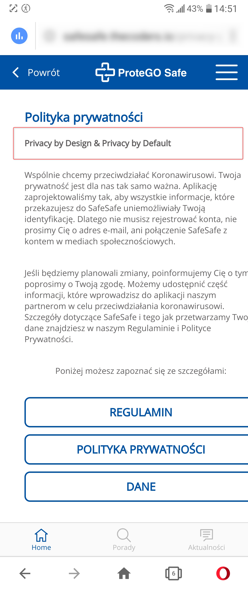

Telefon LG G6 (H870)  
Android 9.0 (3.18.120)  

Kroki, by powtórzyć:  

1. Użytkownik otwiera aplikację SafeSafe  
2. z memu chamburgera wybiera "Polityka Prywatności"  

Aktualny rezultat:  
Część komunikatu wyświetlającego się w "polityka prywatności" jest w języku angielskim  

Ocekiwany rezultat:  
Wszystkie komunikaty w "polityka prywatności" wyświetlane są w języku polskim  

Screeny:  

