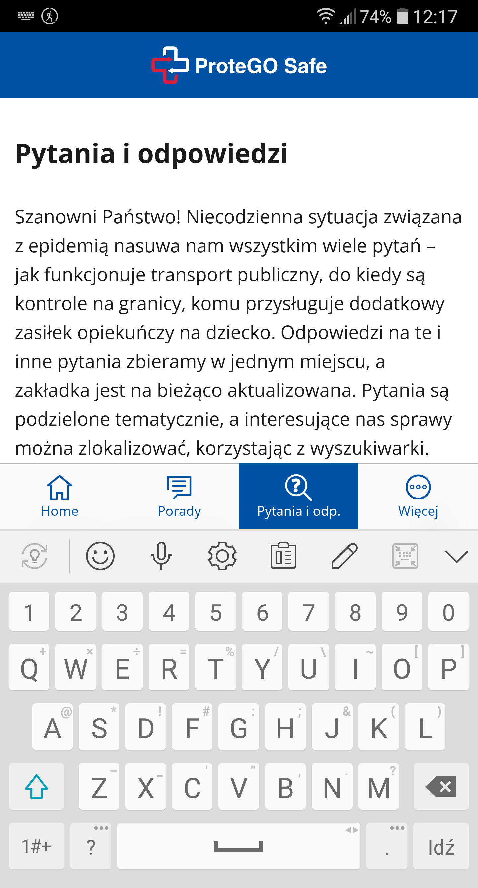

Telefon LG G6 (H870)
Android 9.0 (3.18.120)

Kroki, by powtórzyć:  

1. Otwórz aplikację
2. Przejdź do zakładki [PYTANIA I ODPOWIEDZI]
3. Zaznacz pole wyszukiwania

Aktualny rezultat:
Po zaznaczeniu pola w wyszukiwarce w aplikacji mobilnej (ver. 4.0.0) wysuwa się wirtualna klawiatura. Na sama górę klawiatury zostaje również przesunięta dolna belka MENU, która całkowicie zasłania pole do wpisywania wyszukiwanych przez użytkownika fraz. Trzeba "ręcznie" przesunąć cały ekran żeby pole SEARCH było widoczne.

Oczekiwany rezultat:
Dolna belka menu"chowa się" pod wirtualna klawiaturę, nie zasłaniając pola SEARCH

Screeny:  

