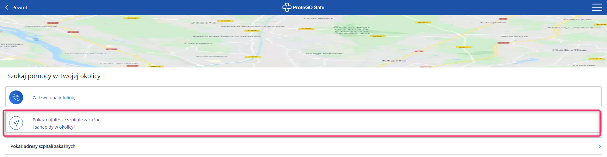
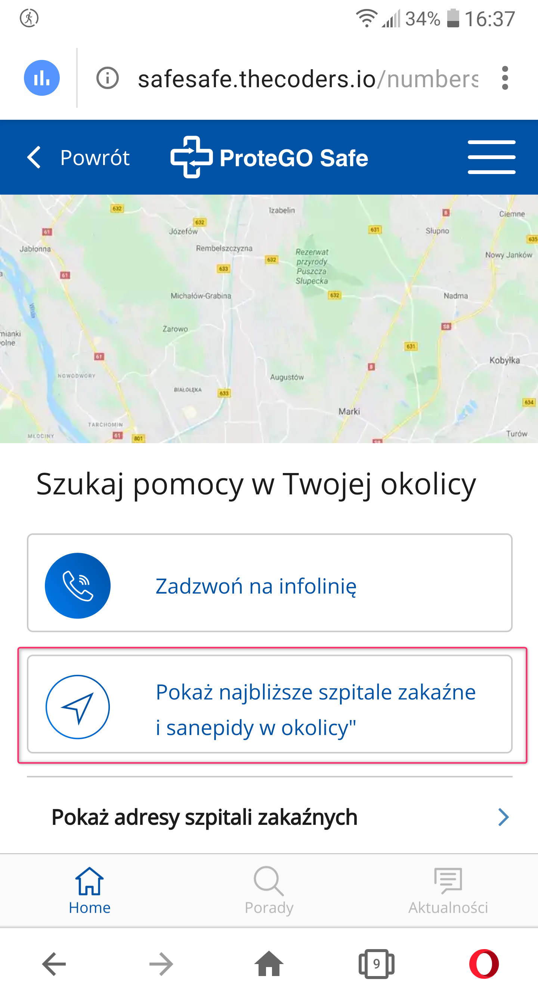

Telefon LG G6 (H870)  
Android 9.0 (3.18.120)   

Problem występuje również w wersji "stacjonarnej" (PC)  

System Operacyjny: Windows 10 Home Edition  
Przeglądarka: Opera 67.0.3575.115  

Kroki, by powtórzyć:  

1. Użytkownik wchodzi w aplikacje SafeSafe, lub wersję desktopową  
2. Z menu chamburgera wybiera "Numery alarmowe"  
3. Wyświetla się nowe okno "szukaj pomocy w Twojej okolicy"  

Aktualny rezultat:  
Przycisk "pokaż najbliższe szpitale zakaźne i sanepidy w okolicy" nie jest aktywny  

Oczekiwany rezultat:  
Przycisk "pokaż najbliższe szpitale zakaźne i sanepidy w okolicy" jest aktywny, (pokazuje zadane wartości na mapach googl'a)  

Screeny:  

