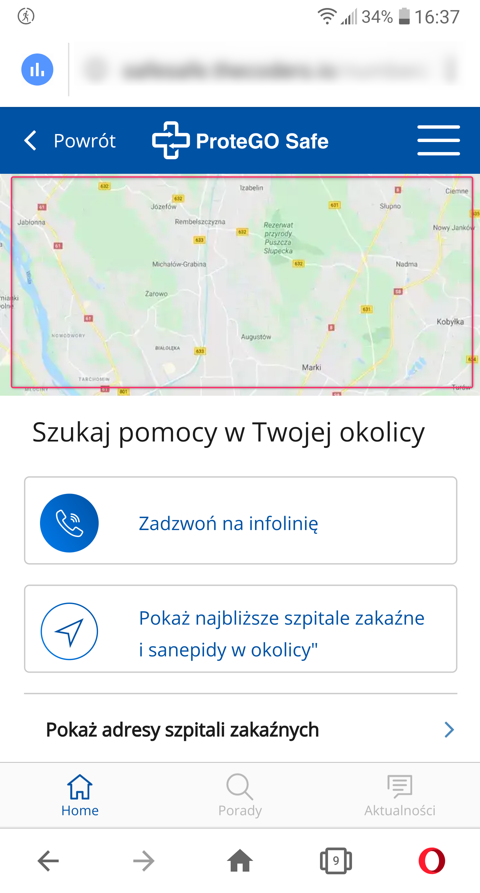
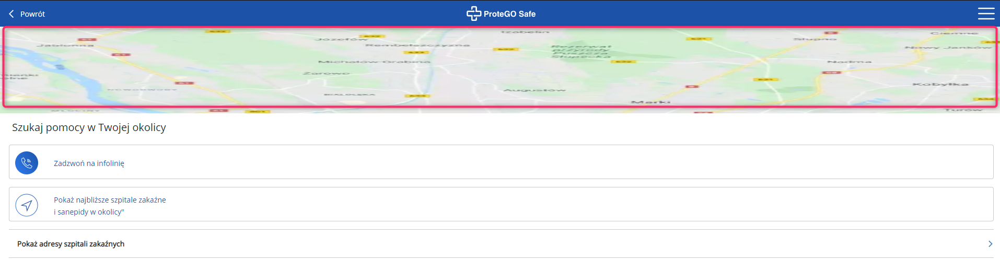

Telefon LG G6 (H870)  
Android 9.0 (3.18.120)  

Problem występuje również w wersji "stacjonarnej (PC)  

System Operacyjny: Windows 10 Home Edition  
Przeglądarka: Opera 67.0.3575.115  

Kroki, by powtórzyć:  

1. Użytkownik wchodzi na aplikacje SafeSafe  
2. Z menu chamburgera wybiera "Numery Alarmowe"  
3. Zostaje wyświetlone okno "Szukaj pomocy w twojej okolicy  

Aktualny rezultat.  
Na samej górze nowo otwartego okna znajduje się obrazek (bitmapa) sugerująca, iż mamy do czynienia z mapami google (jest to tylko screen)  

Oczekiwany rezultat.  
Na górze nowo otwartej strony użytkownik ma faktyczny dostęp do map googla, która umożliwia zlokalizowanie szpitali zakaźnych i (lub) sanepidów w okolicy manualnie, lub przez przycisk "pokaż najbliższe szpitale zakaźne i sanepidy w okolicy"  

Screeny:  

