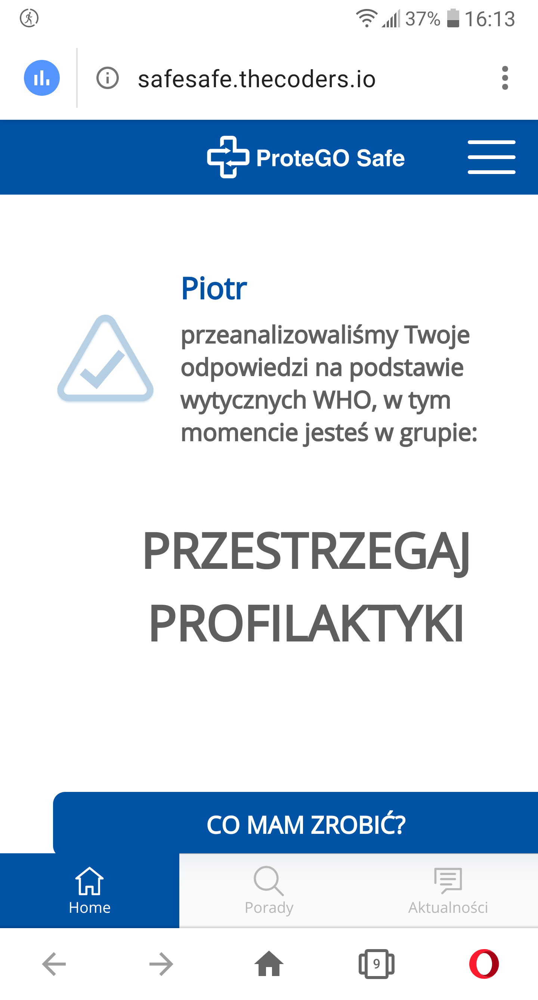

Telefon LG G6 (H870)  
Android 9.0 (3.18.120)  

Problem występuje również w wersji "stacjonarnej" (PC)  

System Operacyjny: Windows 10 Home Edition  
Przeglądarka: Opera 67.0.3575.115  

Po włączeniu aplikacji safesafe, bądź wejściu na wersję przeglądarkową użytkownik zawsze jest witany ekranem informującym o przeanalizowaniu odpowiedzi na podstawie wytycznych WHO i przypisaniu do danej "grupy ryzyka" z testu wykoknanego ostatnim razem.  

Usprawnienie:  
Wprowadzenie strony startowej dla aplikacji SafeSafe jak i wersji "staconarnej" np z bieżącymi informacjami odnoście sytuacji w kraju/regionie? (na podstawie lokalizacji telefonu) 

Screeny:  

