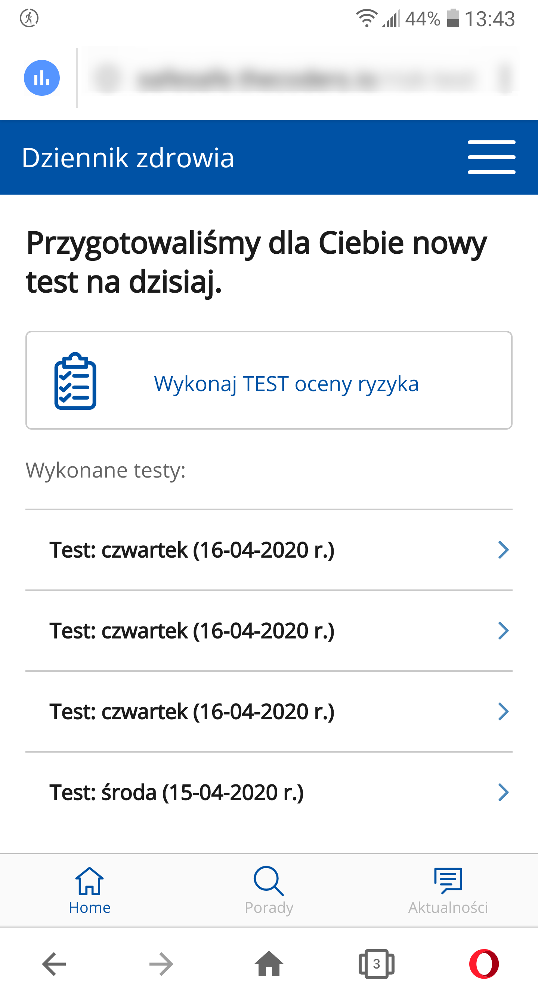

Telefon LG G6 (H870)  
Android 9.0 (3.18.120)  

Problem występuje również w wersji "stacjonarnej (PC)  

System Operacyjny: Windows 10 Home Edition  
Przeglądarka: Opera 67.0.3575.115  

Kroki, by powtórzyć:  

1. Użytkownik otwiera aplikację mobilną SafeSAfe  
2. Z menu Chamburgera wybiera "Ankieta Oceny Ryzyka"  
3. Użytkownik używa przycisku dalej, następnie wypełnia całą ankietę  
4. Po wypełnieniu ankiety używa buttona "Sprawdź wynik"  
5. Używając przycisku menu "chamburgera" ponownie wybiera "Ankieta oceny ryzyka"  
6. Kroki 3-5 wykonuje dowolną ilość razy.  

Screeny:  

