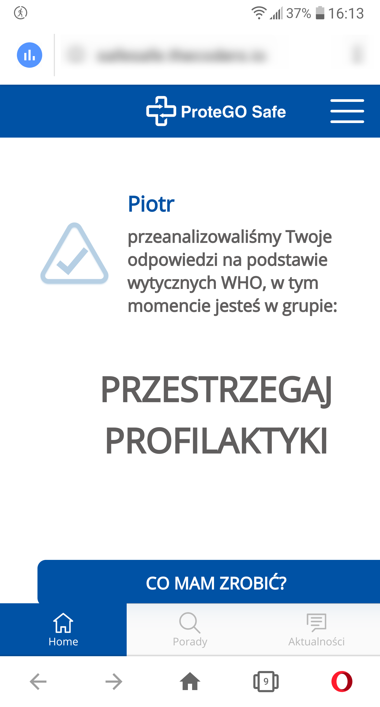

Telefon LG G6 (H870)  
Android 9.0 (3.18.120)  

Kroki, by powtórzyć:  

1. Użytkownik otwiera aplikacje SafeSafe.  
2. Z menu chamburgera wybiera "ankieta oceny ryzyka"  
3. Wybiera "Wykonaj TEST oceny ryzyka"  
4. Wybiera "Dalej"  
5. Wypełnia ankietę  
6.Wybiera "sprawdź wynik"  

Screeny:  

