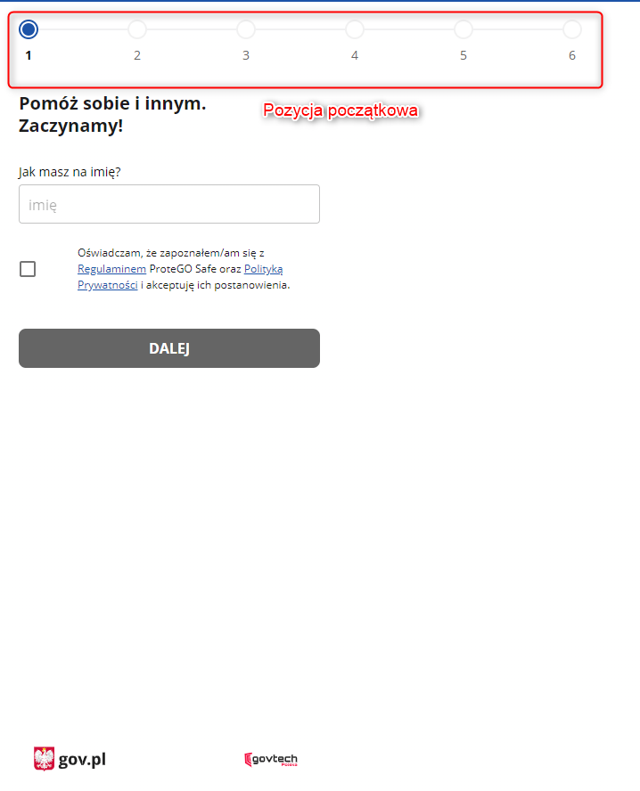

Opis:  

Podczas zakładania nowego konta na wersji desktopowej u góry ekranu wyświetla się "pasek postępu". W miarę wypełniania kolejnych obowiązkowych pól, pasek "ucieka" coraz bardziej w lewą stronę ekranu. (na środku ekranu zawsze znajduje się akurat pozycja (kropka), którą użytkownik aktualnie uzupełnia)  

Kroki, by powtórzyć:  

1. Użytkownik wchodzi na wersję desktopową
2. Użytkownik przystępuje do zakladania nowego konta
3. Użytkownik zaczyna wypełniać obowiązkowe pola (imię, wiek, płeć itd.)

Screeny:  

