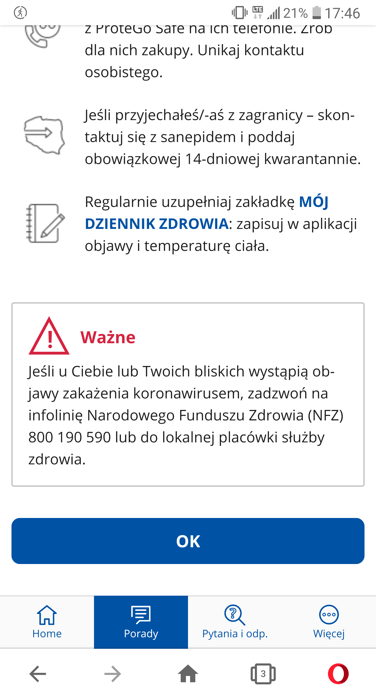

Telefon LG G6 (H870)
Android 9.0 (3.18.120)

Problem występuje również w wersji "stacjonarnej" (PC)

System Operacyjny: Windows 10 Home Edition
Przeglądarka: Opera 67.0.3575.115

Kroki, by powtórzyć:  

1. Użytkownik wchodzi do aplikacji SafeSafe LUB na safesafe-stage.thecoders.io
2. Z dolnej belki wybiera "porady"
3. Na samym dole nowo otwartej strony klika button "OK"

Aktualny rezultat:
Wciśnięcie buttona "OK" powoduje powrót do strony "home"

Oczekiwany rezultat:
Brak Buttona "OK" w sekcji "porady"

Screeny: 

